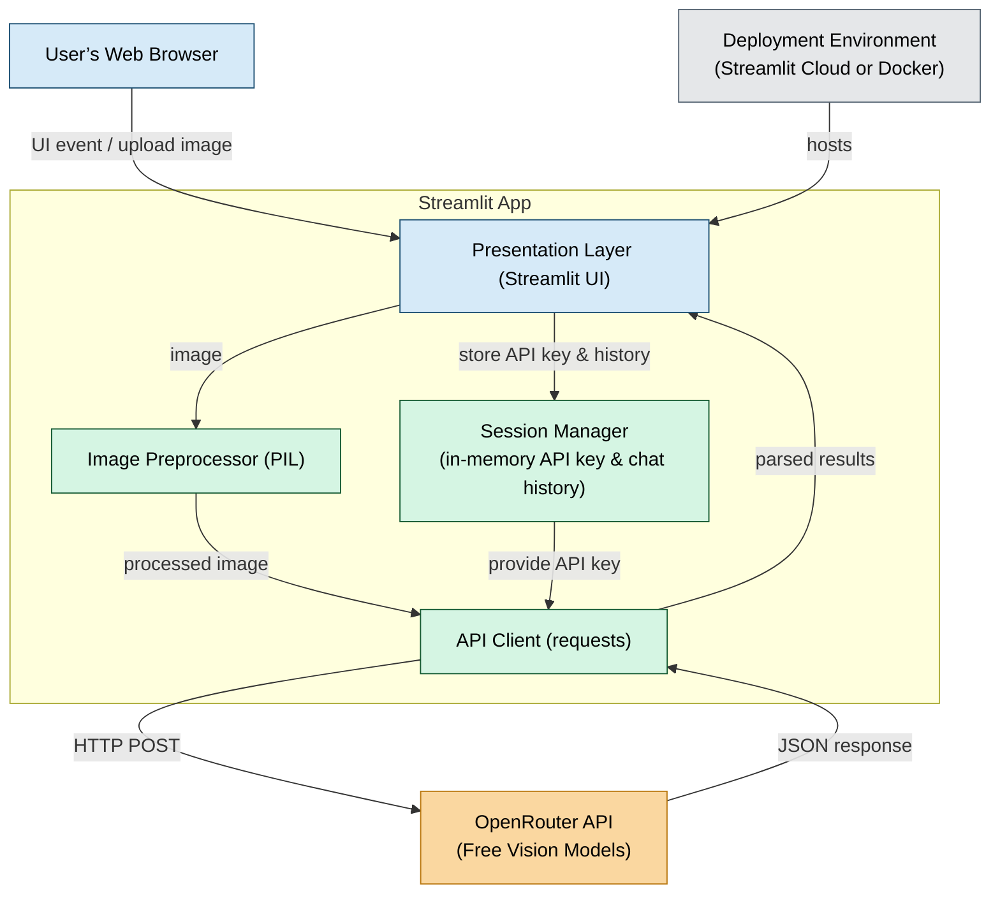

<div align="center">


 # OCR Text Vision Pro

> AI-powered OCR application leveraging free vision models via OpenRouter for advanced image understanding and text extraction

[](https://streamlit.io/)
[](https://python.org/)
[](https://openrouter.ai/)
</div>

## 🤖 Available Models

Select your preferred vision model from the sidebar dropdown. All models are free via OpenRouter:

| Model | Model ID | Context | Strengths |
|---|---|---|---|
| **NVIDIA: Nemotron Nano 12B 2 VL** | `nvidia/nemotron-nano-12b-v2-vl:free` | 128K | #1 on OCRBench v2 — best for OCR, DocVQA, ChartQA |
| **Google: Gemma 3 27B** | `google/gemma-3-27b-it:free` | 131K | General vision-language, multilingual (140+ langs) |
| **Mistral: Mistral Small 3.1 24B** | `mistralai/mistral-small-3.1-24b-instruct:free` | 128K | Image analysis, reasoning, code, math, multilingual |

> **Default**: NVIDIA Nemotron Nano 12B 2 VL is selected by default due to its purpose-built OCR capabilities.

## ✨ Features

### 📈 General OCR & Content Recognition
- **Text Extraction**: Extract readable content from any image
- **LaTeX Conversion**: Convert mathematical equations to LaTeX code with live rendering
- **Code Extraction**: Extract and format code snippets from screenshots
- **Chart Analysis**: Describe charts, diagrams, and visual data

### 📑 Advanced Document Intelligence
- **Document VQA**: Ask specific questions about document content
- **Structured Extraction**: Extract invoice numbers, dates, amounts, etc.
- **Form Processing**: Handle contracts, receipts, and business documents

### ❓ Intelligent Visual Question Answering
- **Scene Understanding**: Analyze and describe image content
- **Object Recognition**: Identify and reason about objects in images
- **Visual Reasoning**: Answer complex questions about visual content

### 🗣️ Multi-modal Chat Assistant
- **Interactive Conversations**: Chat with AI about uploaded images
- **Context Awareness**: Maintains conversation history
- **Real-time Responses**: Instant AI-powered image analysis

## 🔁 Workflow

```mermaid
---
config:
  layout: dagre
  theme: mc
---
flowchart TB
 subgraph subGraph0["Streamlit App"]
        UI["Presentation Layer (Streamlit UI)"]
        PIL["Image Preprocessor (PIL)"]
        APIClient["API Client (requests)"]
        Session["Session Manager<br>(in-memory API key &amp; chat history)"]
  end
    Browser["User’s Web Browser"] -- UI event / upload image --> UI
    UI -- image --> PIL
    PIL -- processed image --> APIClient
    UI -- store API key & history --> Session
    Session -- provide API key --> APIClient
    APIClient -- HTTP POST --> External["OpenRouter API<br>(Free Vision Models)"]
    External -- JSON response --> APIClient
    APIClient -- parsed results --> UI
    Deployment["Deployment Environment<br>(Streamlit Cloud or Docker)"] -- hosts --> UI

     UI:::frontend
     PIL:::app
     APIClient:::app
     Session:::app
     Browser:::frontend
     External:::external
     Deployment:::deployment
    classDef frontend fill:#D6EAF8,stroke:#1B4F72
    classDef app fill:#D5F5E3,stroke:#145A32
    classDef external fill:#FAD7A0,stroke:#B9770E
    classDef deployment fill:#E5E7E9,stroke:#566573
    style UI color:#000000
    style PIL color:#000000
    style APIClient color:#000000
    style Session color:#000000
    style Browser color:#000000
    style External color:#000000
    style Deployment color:#000000
    click UI "https://github.com/bcastelino/ocr-text-vision-pro/blob/main/ocr_app.py"
    click PIL "https://github.com/bcastelino/ocr-text-vision-pro/blob/main/ocr_app.py"
    click APIClient "https://github.com/bcastelino/ocr-text-vision-pro/blob/main/ocr_app.py"
    click Session "https://github.com/bcastelino/ocr-text-vision-pro/blob/main/ocr_app.py"

```

## 🚀 Quick Start

### Option 1: Streamlit Community Cloud (Recommended)
1. **[Deploy directly](https://share.streamlit.io/)** — No setup required!
2. Optionally enter your [OpenRouter API key](https://openrouter.ai/settings/keys) in the sidebar (free to get)
   - Without a key, you get **5 free API calls per session** using the built-in fallback key
3. Select a vision model from the sidebar dropdown
4. Start uploading images and extracting text!

### Option 2: Local Development
```bash
# Clone the repository
git clone https://github.com/bcastelino/ocr-text-vision-pro.git
cd ocr-text-vision-pro

# Install dependencies
pip install -r requirements.txt

# Add your fallback developer API key (optional)
# Edit .streamlit/secrets.toml and replace the placeholder:
# OPENROUTER_API_KEY = "sk-or-v1-your-key-here"

# Run the application
streamlit run ocr_app.py
```

### Option 3: Docker
```bash
# Build and run with Docker
docker build -t ocr-text-vision-pro .
docker run -p 8501:8501 ocr-text-vision-pro
```

## 🔧 Tech Stack

- **Frontend**: Streamlit (Python web framework)
- **AI Models**: NVIDIA Nemotron Nano 12B 2 VL, Google Gemma 3 27B, Mistral Small 3.1 24B (all free via OpenRouter)
- **Image Processing**: PIL/Pillow
- **HTTP Client**: Requests
- **Deployment**: Streamlit Community Cloud

## 📋 Requirements

- Python 3.11+
- OpenRouter API key (free tier available)
- Modern web browser

## 🎯 Use Cases

- **Students**: Extract text from lecture slides and handwritten notes
- **Researchers**: Convert mathematical equations to LaTeX
- **Developers**: Extract code from screenshots and documentation
- **Business**: Process invoices, receipts, and contracts
- **Content Creators**: Analyze charts and extract data for reports

## 🔐 Privacy & Security

- User-provided API keys are stored only in session state (never persisted to disk)
- The built-in fallback key is stored in Streamlit Secrets and is never exposed to the client
- Fallback key usage is capped at **5 calls per session** to prevent abuse
- No image data is stored on the server — images are base64-encoded and sent directly to OpenRouter
- All processing happens through the secure OpenRouter API
- Runs entirely in your browser session

## 🤝 Contributing

Welcome contributors! Please feel free to submit issues and enhancement requests.

## 📄 License

This project is open source and available under the [MIT License](LICENSE).

## 🐱‍👤 Author

<table>
   <tr>
      <td>
         <div style="flex-shrink: 0; order: 2;">
            
         </div>
      </td>
      <td>
         <div align="left" style="padding: 20px;">
            <div style="display: flex; flex-wrap: wrap; justify-content: center; align-items: center; width: 100%; max-width: 800px; gap: 40px; text-align: center;">
               <div style="flex: 1; min-width: 250px; order: 1;">
                  <h1 style="font-size: 2em; margin-bottom: 5px; color: #333;">Brian Denis Castelino</h1>
                  <p style="font-size: 1.2em; color: #555; margin-bottom: 10px;">Data Analytics Engineer | AI Enthusiast</p>
                  <p style="font-size: 1em; color: #777; margin-bottom: 20px;">I turn vague ideas into clean, working systems, because someone’s got to 🤖</p>
                  <div style="display: flex; justify-content: center; gap: 30px;">
                     <a href="https://github.com/bcastelino" target="_blank" style="text-decoration: none;">
                     
                     </a>
                   &nbsp; &nbsp; &nbsp;
                     <a href="https://linkedin.com/in/cas7elino" target="_blank" style="text-decoration: none;">
                     
                     </a>
                   &nbsp; &nbsp; &nbsp;
                     <a href="https://twitter.com/cas7elino" target="_blank" style="text-decoration: none;">
                     
                     </a>
                   &nbsp; &nbsp; &nbsp;
                     <a href="https://instagram.com/cas7elino" target="_blank" style="text-decoration: none;">
                     
                     </a>
                   &nbsp; &nbsp; &nbsp;
                     <a href="https://brianc.framer.website/" target="_blank" style="text-decoration: none;">
                     
                     </a>
                  </div>
               </div>
      </td>
      </div>
      </div>
   </tr>
</table>

---

<div align="center">
Made with ❤️ using Streamlit and free vision models via OpenRouter
</div>
