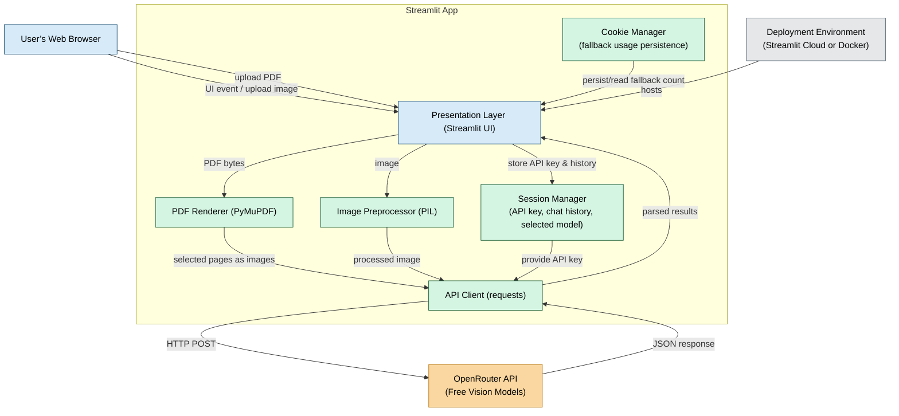

# OCR Text Vision Pro

> Advanced image understanding and text extraction, powered by free vision-language models on OpenRouter

  
  
  
  

  
  
  
  
  
  
  

<table>
  <tr>
    <td align="center" width="50%">
      <a href="https://bcastelino.github.io/ocr-text-vision-pro/">
        
        &nbsp;<b>GitHub Pages App</b>
      </a> 
      Animated React UI &middot; fully client-side
    </td>
    <td align="center" width="50%">
      <a href="https://ocr-text-vision-pro.streamlit.app/">
        
        &nbsp;<b>Streamlit App</b>
      </a> 
      Python UI &middot; built-in fallback API key
    </td>
  </tr>
</table>

---

## 🌐 The GitHub Pages App (primary)

> **Live:** <https://bcastelino.github.io/ocr-text-vision-pro/>

A fully animated, fully client-side rebuild of OCR Text Vision Pro, deployed automatically to GitHub Pages via CI. The source lives in [`web/`](web/) and is the **recommended way to use the app**.

### Highlights

- ⚡ **Vite + React 18 + TypeScript** - instant load, type-safe end to end.
- 🎨 **Tailwind + shadcn-style primitives** - light/dark themes with red/gold accent palettes.
- 🌀 **framer-motion** - scroll-triggered fades, staggered reveals, tab transitions, hover micro-interactions.
- 🌌 **Three.js dotted-surface background** - theme-aware animated particles (ported from [21st.dev](https://21st.dev/community/components/efferd/dotted-surface)).
- 📄 **Client-side PDF rendering** via `pdfjs-dist` - pages render in your browser before being sent as images.
- 🧮 **KaTeX + remark-math** - LaTeX results render live alongside the source.
- 🔐 **localStorage only** - your OpenRouter key never leaves the browser except to call OpenRouter.
- 🚀 **Free deploy on GitHub Pages** - see [`.github/workflows/deploy-pages.yml`](.github/workflows/deploy-pages.yml).

## 🐍 The Streamlit App (secondary)

> **Live:** <https://ocr-text-vision-pro.streamlit.app/>

The original Python/Streamlit application (`ocr_app.py`) is still fully supported. It remains the **only** version that offers the **5-call developer-fallback API key** (the key is stored in `streamlit.secrets` and can't be safely exposed in a static GitHub Pages bundle).

Use the Streamlit version when:

- You want to try the app without creating an OpenRouter account.
- You're more comfortable running Python locally.
- You want a deployable Docker image (see `Dockerfile`).

---

### Differences vs. the Streamlit build

| Feature                              | GitHub Pages | Streamlit |
| ------------------------------------ | :----------: | :-------: |
| User-supplied OpenRouter key         | ✅           | ✅        |
| 5-call developer-fallback key        | ❌ (insecure on a static site) | ✅ |
| Extract / Ask / Chat / PDF workflows | ✅           | ✅        |
| Model selector (free + paid + auto)  | ✅           | ✅ (free only) |
| Dark mode                            | ✅ (theme-aware) | partial |
| Animated UI / 3D background          | ✅           | ❌        |

See [`web/README.md`](web/README.md) for local-development instructions for the React build.

---

## 🤖 Available Models

Models are managed in [`web/src/lib/models.ts`](web/src/lib/models.ts) for the React build and inside `ocr_app.py` for Streamlit. The GitHub Pages app exposes free, paid, and a universal auto-router tier; the Streamlit app ships the free tier only.

| Model | Model ID | Context | Tier | Input / 1M | Output / 1M | Strengths |
|---|---|---|---|---|---|---|
| **OpenRouter: Free Auto Router** ⭐ default | `openrouter/free` | Varies | Free | $0.00 | $0.00 | Automatically selects the best free model for each request based on required features |
| **NVIDIA: Nemotron Nano 12B 2 VL** | `nvidia/nemotron-nano-12b-v2-vl:free` | 128K | Free | $0.00 | $0.00 | #1 on OCRBench v2 - best for OCR, DocVQA, ChartQA |
| **Google: Gemma 3 27B** | `google/gemma-3-27b-it:free` | 131K | Free | $0.00 | $0.00 | General vision-language, multilingual (140+ langs) |
| **Mistral: Mistral Small 3.1 24B** | `mistralai/mistral-small-3.1-24b-instruct:free` | 128K | Free | $0.00 | $0.00 | Image analysis, reasoning, code, math, multilingual |
| **Meta: Llama 3.2 11B Vision Instruct** | `meta-llama/llama-3.2-11b-vision-instruct` | 131K | Paid | $0.245 | $0.245 | Multimodal image reasoning, captioning, VQA |
| **Qwen: Qwen3 VL 32B Instruct** | `qwen/qwen3-vl-32b-instruct` | 131K | Paid | $0.104 | $0.416 | High-precision multimodal understanding (text, image, video) |
| **OpenRouter: Auto Router** | `openrouter/auto` | 2M | Universal | Varies | Varies | Automatically selects the best model for each request |

> **Default**: OpenRouter Free Auto Router is pre-selected in both apps for optimal free model selection based on request requirements.

## ✨ Features

### 📈 Extract & Convert

- **Text Extraction**: Extract readable content from any image
- **LaTeX Conversion**: Convert mathematical equations to LaTeX code with live rendering
- **Code Extraction**: Extract and format code snippets from screenshots
- **Chart Analysis**: Describe charts, diagrams, and visual data

### 🎯 Ask, Analyze & Chat

- **One-time Answer Mode**: Ask a direct question on an uploaded image
- **Document Intelligence Scope**: Extract invoice numbers, dates, totals, and structured document fields
- **Visual Question Answering Scope**: Reason about scenes, objects, and image context
- **Chat Session Mode**: Multi-turn conversation over the same uploaded image with history

### 📑 PDF Scan & Extract

- **Native PDF Upload**: Upload PDF files directly
- **Flexible Page Selection**: Scan all pages or specific pages/ranges like `1-5, 8, 12, 34`
- **Multi-page Vision Parsing**: Converts selected pages to images and sends them in one request
- **Shared Extraction Modes**: Text, LaTeX, Code, and Chart/Diagram extraction from PDF pages

### 📱 Responsive Experience

- **Mobile, Tablet, Desktop Adaptation**: Layout and spacing optimized with breakpoints
- **Adaptive Tabs and Typography**: Better readability and navigation across screen sizes

## 🔁 Workflow

```mermaid
---
config:
  layout: dagre
  theme: mc
---
flowchart TB
 subgraph subGraph0["Streamlit App"]
        UI["Presentation Layer (Streamlit UI)"]
            PIL["Image Preprocessor (PIL)"]
            PDF["PDF Renderer (PyMuPDF)"]
        APIClient["API Client (requests)"]
            Session["Session Manager<br>(API key, chat history, selected model)"]
            Cookies["Cookie Manager<br>(fallback usage persistence)"]
  end
    Browser["User’s Web Browser"] -- UI event / upload image --> UI
      Browser -- upload PDF --> UI
    UI -- image --> PIL
      UI -- PDF bytes --> PDF
      PDF -- selected pages as images --> APIClient
    PIL -- processed image --> APIClient
    UI -- store API key & history --> Session
    Session -- provide API key --> APIClient
      Cookies -- persist/read fallback count --> UI
    APIClient -- HTTP POST --> External["OpenRouter API<br>(Free Vision Models)"]
    External -- JSON response --> APIClient
    APIClient -- parsed results --> UI
    Deployment["Deployment Environment<br>(Streamlit Cloud or Docker)"] -- hosts --> UI

     UI:::frontend
     PIL:::app
   PDF:::app
     APIClient:::app
     Session:::app
   Cookies:::app
     Browser:::frontend
     External:::external
     Deployment:::deployment
    classDef frontend fill:#D6EAF8,stroke:#1B4F72
    classDef app fill:#D5F5E3,stroke:#145A32
    classDef external fill:#FAD7A0,stroke:#B9770E
    classDef deployment fill:#E5E7E9,stroke:#566573
    style UI color:#000000
    style PIL color:#000000
   style PDF color:#000000
    style APIClient color:#000000
    style Session color:#000000
   style Cookies color:#000000
    style Browser color:#000000
    style External color:#000000
    style Deployment color:#000000
    click UI "https://github.com/bcastelino/ocr-text-vision-pro/blob/main/ocr_app.py"
    click PIL "https://github.com/bcastelino/ocr-text-vision-pro/blob/main/ocr_app.py"
   click PDF "https://github.com/bcastelino/ocr-text-vision-pro/blob/main/ocr_app.py"
    click APIClient "https://github.com/bcastelino/ocr-text-vision-pro/blob/main/ocr_app.py"
    click Session "https://github.com/bcastelino/ocr-text-vision-pro/blob/main/ocr_app.py"
   click Cookies "https://github.com/bcastelino/ocr-text-vision-pro/blob/main/ocr_app.py"

```

## 🔧 Tech Stack

### GitHub Pages app (`web/`)

- **Framework:** Vite + React 18 + TypeScript
- **Styling:** TailwindCSS, custom shadcn-style primitives on Radix UI
- **Animation:** framer-motion, Three.js dotted-surface background
- **PDF rendering:** `pdfjs-dist` (fully client-side)
- **Markdown / Math:** `react-markdown` + `remark-gfm` + `remark-math` + `rehype-katex`
- **Theme:** `next-themes` (system / dark / light, red & gold palettes)
- **Hosting:** GitHub Pages via GitHub Actions

### Streamlit app (`ocr_app.py`)

- **Framework:** Streamlit (Python)
- **Image processing:** PIL/Pillow
- **PDF processing:** PyMuPDF (`fitz`)
- **HTTP client:** Requests
- **Cookie persistence:** `streamlit-cookies-controller`
- **Hosting:** Streamlit Community Cloud (Docker-ready)

### Shared

- **Models:** NVIDIA Nemotron Nano 12B 2 VL, Google Gemma 3 27B, Mistral Small 3.1 24B, plus Llama 3.2 11B Vision, Qwen3 VL 32B, and the OpenRouter Auto Router (GH Pages app only).
- **Inference:** [OpenRouter API](https://openrouter.ai/)

## 📋 Requirements

- Python 3.11+
- OpenRouter API key (free tier available)
- Modern web browser

## 🎯 Use Cases

- **Students**: Extract text from lecture slides and handwritten notes
- **Analysts**: Scan selected PDF pages and extract structured insights
- **Researchers**: Convert mathematical equations to LaTeX
- **Developers**: Extract code from screenshots and documentation
- **Business**: Process invoices, receipts, and contracts
- **Content Creators**: Analyze charts and extract data for reports

## 🔐 Privacy & Security

**GitHub Pages app**

- 100% client-side. There is no server.
- Your OpenRouter API key lives only in your browser's `localStorage`.
- Images and PDF page renders are converted to base64 in-browser and POSTed directly to OpenRouter - they never touch any infrastructure I control.
- No analytics, no tracking, no cookies.

**Streamlit app**

- User-provided API keys live only in Streamlit session state (never persisted to disk).
- The built-in fallback key is stored in Streamlit Secrets and is never exposed to the client.
- Fallback key usage is capped at **5 calls per browser cookie lifecycle** to prevent abuse.
- Image/PDF data is converted to base64 in-memory and sent directly to OpenRouter - nothing is stored on the Streamlit server.

## 🤝 Contributing

Welcome contributors! Please feel free to submit issues and enhancement requests.

## 📄 License

This project is open source and available under the [MIT License](LICENSE).

## 🐱‍👤 Author

<table>
   <tr>
      <td>
         

            
         

      </td>
      <td>
         

            

               

                  <h1 style="font-size: 2em; margin-bottom: 5px; color: #333;">Brian Denis Castelino</h1>
                  
Data Analytics Engineer | AI Enthusiast

                  
I turn vague ideas into clean, working systems, because someone’s got to 🤖

                  

                     
                   &nbsp; &nbsp; &nbsp;
                     
                   &nbsp; &nbsp; &nbsp;
                     
                   &nbsp; &nbsp; &nbsp;
                     
                   &nbsp; &nbsp; &nbsp;
                     
                  

               

      </td>
      

      

   </tr>
</table>

---

Made with ❤️ using React, Streamlit and free vision models via OpenRouter

