<div align="center">


 # OCR Text Vision Pro

> AI-powered OCR application using Llama 3.2 Vision for advanced image understanding and text extraction

[](https://streamlit.io/)
[](https://python.org/)
[](https://openrouter.ai/)
</div>

## ✨ Features

### 📈 General OCR & Content Recognition
- **Text Extraction**: Extract readable content from any image
- **LaTeX Conversion**: Convert mathematical equations to LaTeX code with live rendering
- **Code Extraction**: Extract and format code snippets from screenshots
- **Chart Analysis**: Describe charts, diagrams, and visual data

### 📑 Advanced Document Intelligence
- **Document VQA**: Ask specific questions about document content
- **Structured Extraction**: Extract invoice numbers, dates, amounts, etc.
- **Form Processing**: Handle contracts, receipts, and business documents

### ❓ Intelligent Visual Question Answering
- **Scene Understanding**: Analyze and describe image content
- **Object Recognition**: Identify and reason about objects in images
- **Visual Reasoning**: Answer complex questions about visual content

### 🗣️ Multi-modal Chat Assistant
- **Interactive Conversations**: Chat with AI about uploaded images
- **Context Awareness**: Maintains conversation history
- **Real-time Responses**: Instant AI-powered image analysis

## 🔁 Workflow

```mermaid
flowchart TB
 subgraph subGraph0["Streamlit App"]
        UI["Presentation Layer (Streamlit UI)"]
        PIL["Image Preprocessor (PIL)"]
        APIClient["API Client (requests)"]
        Session["Session Manager<br>(in-memory API key &amp; chat history)"]
  end
    Browser["User’s Web Browser"] -- UI event / upload image --> UI
    UI -- image --> PIL
    PIL -- processed image --> APIClient
    UI -- store API key & history --> Session
    Session -- provide API key --> APIClient
    APIClient -- HTTP POST --> External["OpenRouter API<br>(Llama 3.2 Vision)"]
    External -- JSON response --> APIClient
    APIClient -- parsed results --> UI
    Deployment["Deployment Environment<br>(Streamlit Cloud or Docker)"] -- hosts --> UI

     UI:::frontend
     PIL:::app
     APIClient:::app
     Session:::app
     Browser:::frontend
     External:::external
     Deployment:::deployment
    classDef frontend fill:#D6EAF8,stroke:#1B4F72
    classDef app fill:#D5F5E3,stroke:#145A32
    classDef external fill:#FAD7A0,stroke:#B9770E
    classDef deployment fill:#E5E7E9,stroke:#566573
    style Browser color:#000000
    style External color:#000000
    style Deployment color:#000000
    click UI "https://github.com/bcastelino/ocr-text-vision-pro/blob/main/ocr_app.py"
    click PIL "https://github.com/bcastelino/ocr-text-vision-pro/blob/main/ocr_app.py"
    click APIClient "https://github.com/bcastelino/ocr-text-vision-pro/blob/main/ocr_app.py"
    click Session "https://github.com/bcastelino/ocr-text-vision-pro/blob/main/ocr_app.py"

```


## 🚀 Quick Start

### Option 1: Streamlit Community Cloud (Recommended)
1. **[Deploy directly](https://share.streamlit.io/)** - No setup required!
2. Enter your [OpenRouter API key](https://openrouter.ai/settings/keys) (free)
3. Start uploading images and extracting text!

### Option 2: Local Development
```bash
# Clone the repository
git clone https://github.com/bcastelino/ocr-text-vision-pro.git
cd ocr-text-vision-pro

# Install dependencies
pip install -r requirements.txt

# Run the application
streamlit run ocr_app.py
```

### Option 3: Docker
```bash
# Build and run with Docker
docker build -t ocr-text-vision-pro .
docker run -p 8501:8501 ocr-text-vision-pro
```

## 🔧 Tech Stack

- **Frontend**: Streamlit (Python web framework)
- **AI Model**: Llama 3.2-11B Vision (via OpenRouter API)
- **Image Processing**: PIL/Pillow
- **HTTP Client**: Requests
- **Deployment**: Streamlit Community Cloud

## 📋 Requirements

- Python 3.11+
- OpenRouter API key (free tier available)
- Modern web browser

## 🎯 Use Cases

- **Students**: Extract text from lecture slides and handwritten notes
- **Researchers**: Convert mathematical equations to LaTeX
- **Developers**: Extract code from screenshots and documentation
- **Business**: Process invoices, receipts, and contracts
- **Content Creators**: Analyze charts and extract data for reports

## 🔐 Privacy & Security

- API keys are stored only in session (not persisted)
- No image data is stored on our servers
- All processing happens through secure OpenRouter API
- Runs entirely in your browser session

## 🤝 Contributing

We welcome contributions! Please feel free to submit issues and enhancement requests.

## 📄 License

This project is open source and available under the [MIT License](LICENSE).

## 👤 Author

**Brian Castelino**
- GitHub: [@bcastelino](https://github.com/bcastelino)
- LinkedIn: [@cas7elino](https://linkedin.com/in/cas7elino)
- Twitter: [@cas7elino](https://twitter.com/cas7elino)

---

<div align="center">
Made with ❤️ using Streamlit and Llama 3.2 Vision
</div>
